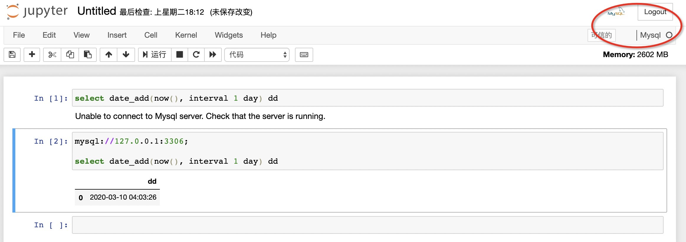

# Mysql_kernel
Jupyter Kernel for Mysql

## Install

```
pip3 install mysql_kernel
```

Add kernel to your jupyter:

```
python3 -m mysql_kernel.install
```

ALL DONE! 🎉🎉🎉

## Using

```
jupyter notebook
```


### step1: you should set mysql host and port

### step2: write your mysql code


## Quote 
kernel logo


